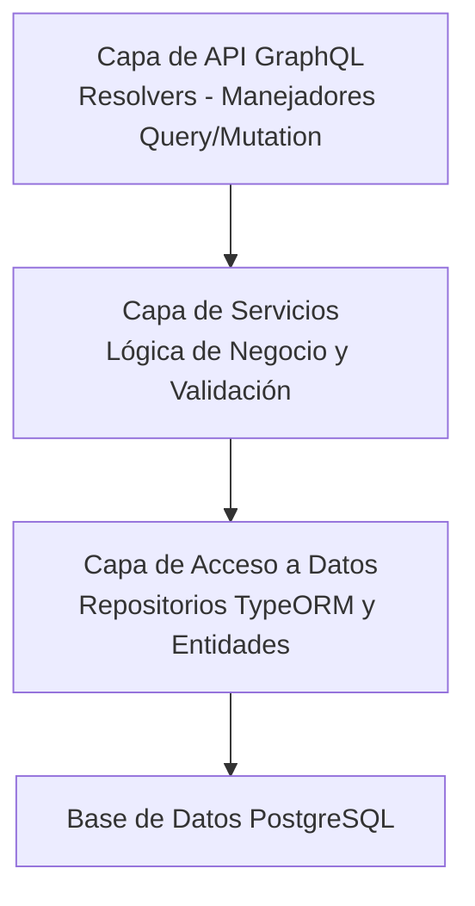
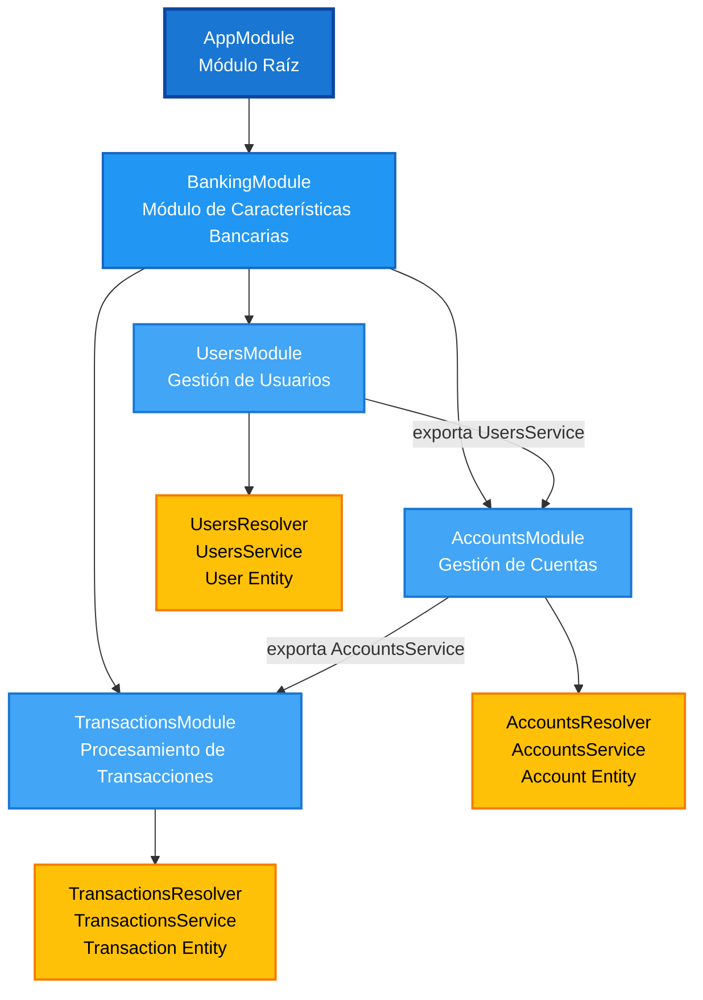

# API GraphQL de Banca

Una aplicación bancaria completa construida con NestJS y GraphQL, que demuestra patrones de arquitectura backend modernos, diseño de API GraphQL y gestión de transacciones de base de datos. Este proyecto sirve como ejemplo educativo para construir una API GraphQL lista para producción con separación adecuada de responsabilidades, seguridad de tipos e integridad de datos.

## Tabla de Contenidos

- [Resumen](#resumen)
- [Arquitectura](#arquitectura)
- [Stack Tecnológico](#stack-tecnológico)
- [¿Por Qué Esta Arquitectura?](#por-qué-esta-arquitectura)
- [Estructura del Proyecto](#estructura-del-proyecto)
- [Cómo Funciona](#cómo-funciona)
- [Comenzando](#comenzando)
- [Documentación de la API](#documentación-de-la-api)
- [Esquema de Base de Datos](#esquema-de-base-de-datos)
- [Características Principales](#características-principales)

## Resumen

Esta aplicación bancaria proporciona una API GraphQL para gestionar usuarios, cuentas bancarias y transacciones financieras. Implementa operaciones bancarias principales incluyendo:

- Gestión de usuarios (crear y consultar usuarios)
- Gestión de cuentas (abrir cuentas con diferentes tipos y monedas)
- Procesamiento de transacciones (depósitos y transferencias con validación de saldo)
- Historial de transacciones (consultar transacciones por cuenta)

La aplicación demuestra mejores prácticas en:
- Diseño de esquema GraphQL y patrones de resolvers
- Transacciones de base de datos para consistencia de datos
- Relaciones de entidades TypeORM
- Validación de entrada y manejo de errores
- Arquitectura modular con NestJS

## Arquitectura

### Arquitectura de Alto Nivel

La aplicación sigue un patrón de arquitectura en capas:



### Organización de Módulos

La aplicación está organizada en módulos de características siguiendo las mejores prácticas de NestJS:

- **BankingModule**: Módulo principal de características que agrega toda la funcionalidad relacionada con banca
  - **UsersModule**: Gestión de usuarios (operaciones CRUD)
  - **AccountsModule**: Gestión de cuentas (abrir cuentas, consultar cuentas)
  - **TransactionsModule**: Procesamiento de transacciones (depósitos, transferencias, historial)



Cada módulo sigue la misma estructura:
- `*.resolver.ts`: Resolvers GraphQL (puntos de entrada para queries/mutations)
- `*.service.ts`: Lógica de negocio y operaciones de datos
- `entities/`: Definiciones de entidades TypeORM (modelos de base de datos)
- `dto/`: Objetos de Transferencia de Datos para validación de entrada

## Stack Tecnológico

### Framework Principal
- **NestJS**: Framework progresivo de Node.js para construir aplicaciones del lado del servidor eficientes y escalables
  - ¿Por qué NestJS?: Proporciona inyección de dependencias, arquitectura modular y excelente soporte para TypeScript desde el inicio

### GraphQL
- **@nestjs/graphql**: Integración GraphQL para NestJS
- **@nestjs/apollo**: Integración de Apollo Server para NestJS
- **graphql**: Biblioteca principal de GraphQL
  - ¿Por qué GraphQL?: Permite a los clientes solicitar exactamente los datos que necesitan, reduciendo la sobrecarga y la falta de datos comunes en las APIs REST

### Base de Datos
- **TypeORM**: Biblioteca de Mapeo Objeto-Relacional
- **PostgreSQL**: Base de datos relacional
  - ¿Por qué TypeORM?: Operaciones de base de datos con seguridad de tipos, soporte de migraciones y excelente integración con NestJS
  - ¿Por qué PostgreSQL?: Cumplimiento ACID, soporte robusto de transacciones y características sólidas de integridad de datos esenciales para aplicaciones bancarias

### Validación
- **class-validator**: Validación basada en decoradores
- **class-transformer**: Utilidades de transformación de objetos
  - ¿Por qué?: Asegura la integridad de los datos en el límite de la API antes de la ejecución de la lógica de negocio

## ¿Por Qué Esta Arquitectura?

### 1. GraphQL Sobre REST

**Problema**: Las APIs REST a menudo llevan a sobrecarga (obtener más datos de los necesarios) o falta de datos (requerir múltiples solicitudes).

**Solución**: GraphQL permite a los clientes especificar exactamente qué datos necesitan en una sola solicitud.

**Ejemplo**:
```graphql
# El cliente solicita solo los campos necesarios
query {
  user(id: "123") {
    email
    fullName
  }
}
```

### 2. Arquitectura Modular

**Problema**: Las bases de código monolíticas se vuelven difíciles de mantener y escalar.

**Solución**: Módulos basados en características con límites y responsabilidades claros.

**Beneficios**:
- Cada módulo es autocontenido y testeable
- Fácil agregar nuevas características sin afectar el código existente
- Separación clara entre la capa GraphQL, lógica de negocio y acceso a datos

### 3. Patrón de Capa de Servicios

**Problema**: La lógica de negocio mezclada con los manejadores de API hace que el código sea difícil de probar y reutilizar.

**Solución**: Los resolvers delegan a servicios que contienen toda la lógica de negocio.

**Beneficios**:
- La lógica de negocio puede probarse independientemente
- Los servicios pueden reutilizarse por diferentes resolvers u otras partes de la aplicación
- Separación clara de responsabilidades

### 4. Transacciones de Base de Datos

**Problema**: Las operaciones financieras deben ser atómicas - si cualquier paso falla, todos los cambios deben revertirse.

**Solución**: Usar transacciones de base de datos para operaciones que modifican múltiples registros.

**Ejemplo**: Al transferir fondos:
1. Débito de la cuenta origen
2. Crédito a la cuenta destino
3. Crear registro de transacción

Si cualquier paso falla, toda la operación se revierte, asegurando la consistencia de los datos.

### 5. Seguridad de Tipos

**Problema**: Los errores en tiempo de ejecución por desajustes de tipos son difíciles de detectar y depurar.

**Solución**: TypeScript en toda la pila, desde tipos GraphQL hasta entidades de base de datos.

**Beneficios**:
- Detección de errores en tiempo de compilación
- Mejor soporte de IDE y autocompletado
- Código autodocumentado

## Estructura del Proyecto

```
src/
├── main.ts                 # Punto de entrada de la aplicación
├── app.module.ts          # Módulo raíz (configura GraphQL, TypeORM, etc.)
├── schema.graphql         # Esquema GraphQL auto-generado
│
└── banking/               # Módulo de características bancarias
    ├── banking.module.ts  # Agrega todos los submódulos bancarios
    │
    ├── users/            # Módulo de gestión de usuarios
    │   ├── users.resolver.ts
    │   ├── users.service.ts
    │   ├── entities/
    │   │   └── user.entity.ts
    │   └── dto/
    │       └── create-user.dto.ts
    │
    ├── accounts/          # Módulo de gestión de cuentas
    │   ├── accounts.resolver.ts
    │   ├── accounts.service.ts
    │   ├── entities/
    │   │   └── account.entity.ts
    │   └── dto/
    │       └── create-account.dto.ts
    │
    ├── transactions/      # Módulo de procesamiento de transacciones
    │   ├── transactions.resolver.ts
    │   ├── transactions.service.ts
    │   ├── entities/
    │   │   └── transaction.entity.ts
    │   └── dto/
    │       ├── deposit-funds.input.ts
    │       └── transfer-funds.input.ts
    │
    └── models/            # Tipos GraphQL y enums compartidos
        ├── banking-graphql-types.ts
        └── banking.enums.ts

docs/
├── queries.graphql        # Ejemplos de queries
├── mutations.graphql      # Ejemplos de mutations
└── README.md             # Documentación de ejemplos
```

## Cómo Funciona

### Paso 1: Flujo de Solicitud

Cuando se recibe una query o mutation GraphQL:

1. **Capa GraphQL**: La solicitud se analiza y valida contra el esquema
2. **Resolver**: Se llama al método resolver apropiado
3. **Servicio**: El resolver delega a un método de servicio que contiene la lógica de negocio
4. **Repositorio**: El servicio usa repositorios TypeORM para interactuar con la base de datos
5. **Respuesta**: Los datos fluyen de vuelta a través de las capas, transformados para coincidir con el esquema GraphQL

### Paso 2: Ejemplo de Creación de Usuario

```graphql
mutation {
  createUser(input: {
    email: "user@example.com"
    fullName: "Juan Pérez"
  }) {
    id
    email
  }
}
```

**Flujo**:
1. `UsersResolver.createUser()` recibe la entrada
2. `UsersService.create()` valida y crea la entidad de usuario
3. TypeORM guarda el usuario en la base de datos
4. El usuario creado se devuelve y se formatea según la query GraphQL

### Paso 3: Ejemplo de Apertura de Cuenta

```graphql
mutation {
  openAccount(input: {
    userId: "user-id"
    type: CHECKING
    currency: USD
    alias: "Mi Cuenta Corriente"
  }) {
    id
    accountNumber
    balance
  }
}
```

**Flujo**:
1. `AccountResolver.openAccount()` recibe la entrada
2. `AccountsService.openAccount()`:
   - Valida que el usuario existe
   - Genera un número de cuenta único
   - Crea la cuenta con saldo inicial de 0
   - Guarda en la base de datos
3. Devuelve la cuenta creada

### Paso 4: Ejemplo de Procesamiento de Transacciones

#### Depósito

```graphql
mutation {
  deposit(input: {
    toAccountId: "account-id"
    amount: 1000.00
    description: "Depósito inicial"
  }) {
    id
    status
    toAccount {
      balance
    }
  }
}
```

**Flujo**:
1. `TransactionsResolver.deposit()` recibe la entrada
2. `TransactionsService.deposit()` se ejecuta dentro de una transacción de base de datos:
   - Encuentra la cuenta
   - Actualiza el saldo de la cuenta (operación atómica)
   - Crea un registro de transacción
   - Si cualquier paso falla, toda la operación se revierte
3. Devuelve la transacción con el saldo de cuenta actualizado

#### Transferencia

```graphql
mutation {
  transferFunds(input: {
    fromAccountId: "account-1"
    toAccountId: "account-2"
    amount: 500.00
    description: "Pago"
  }) {
    id
    status
    fromAccount { balance }
    toAccount { balance }
  }
}
```

**Flujo**:
1. `TransactionsResolver.transferFunds()` recibe la entrada
2. `TransactionsService.transferFunds()` se ejecuta dentro de una transacción de base de datos:
   - Valida que ambas cuentas existen
   - Valida coincidencia de moneda
   - Valida fondos suficientes
   - Debita de la cuenta origen
   - Acredita a la cuenta destino
   - Crea registro de transacción
   - Todas las operaciones son atómicas (todas tienen éxito o todas fallan)
3. Devuelve la transacción con los saldos actualizados

### Paso 5: Consulta de Datos

```graphql
query {
  transactionsByAccount(accountId: "account-id") {
    id
    amount
    type
    status
    createdAt
  }
}
```

**Flujo**:
1. `TransactionsResolver.transactionsByAccount()` recibe el ID de cuenta
2. `TransactionsService.listByAccount()` consulta la base de datos:
   - Encuentra todas las transacciones donde la cuenta es remitente o receptor
   - Incluye datos de cuenta relacionados
   - Ordena por fecha de creación (más recientes primero)
3. Devuelve la lista de transacciones

## Comenzando

### Prerrequisitos

- Node.js (v22.21.1 o superior)
- Yarn (gestor de paquetes)
- Docker y Docker Compose (para PostgreSQL)

### Instalación

1. **Clonar el repositorio**
   ```bash
   git clone <url-del-repositorio>
   cd nest-graphql-bank
   ```

2. **Instalar dependencias**
   ```bash
   yarn install
   ```

3. **Configurar variables de entorno**
   
   Se proporciona un archivo `.env.template` como referencia. Crear un archivo `.env` en el directorio raíz con datos simulados:
   ```env
   POSTGRES_HOST=localhost
   POSTGRES_PORT=5432
   POSTGRES_USER=bank_user
   POSTGRES_PASSWORD=bank_password
   POSTGRES_DB=bank_db
   PORT=3000
   ```
   
   Puedes copiar el archivo template y modificar los valores según sea necesario:
   ```bash
   cp .env.template .env
   ```

4. **Iniciar la base de datos PostgreSQL**
   ```bash
   docker compose up -d
   ```

5. **Iniciar la aplicación**
   ```bash
   yarn start:dev
   ```

   La aplicación estará disponible en `http://localhost:3000`
   GraphQL Playground estará disponible en `http://localhost:3000/graphql`

### Comandos de Desarrollo

```bash
# Iniciar en modo desarrollo (con recarga automática)
yarn start:dev

# Compilar para producción
yarn build

# Iniciar en modo producción
yarn start:prod

# Ejecutar linter
yarn lint

# Ejecutar tests
yarn test

# Ejecutar tests e2e
yarn test:e2e
```

## Documentación de la API

### Endpoint GraphQL

La API GraphQL está disponible en:
```
http://localhost:3000/graphql
```

### Documentación Interactiva

Apollo Studio Sandbox está disponible en el mismo endpoint, proporcionando:
- Editor de queries interactivo
- Explorador de esquema
- Historial de queries
- Editor de variables

### Ejemplos de Queries y Mutations

Ejemplos completos están disponibles en el directorio `docs/`:

- **[Ejemplos de Queries](./docs/queries.graphql)** - Todas las queries GraphQL disponibles
- **[Ejemplos de Mutations](./docs/mutations.graphql)** - Todas las mutations GraphQL disponibles

Estos archivos contienen ejemplos listos para usar que puedes copiar y pegar en tu cliente GraphQL.

### Ejemplo de Inicio Rápido

1. **Crear un usuario:**
   ```graphql
   mutation {
     createUser(input: {
       email: "juan.perez@example.com"
       fullName: "Juan Pérez"
     }) {
       id
       email
       fullName
     }
   }
   ```

2. **Abrir una cuenta:**
   ```graphql
   mutation {
     openAccount(input: {
       userId: "<user-id-del-paso-1>"
       type: CHECKING
       currency: USD
       alias: "Mi Cuenta Corriente"
     }) {
       id
       accountNumber
       balance
     }
   }
   ```

3. **Depositar fondos:**
   ```graphql
   mutation {
     deposit(input: {
       toAccountId: "<account-id-del-paso-2>"
       amount: 1000.00
       description: "Depósito inicial"
     }) {
       id
       status
       toAccount {
         balance
       }
     }
   }
   ```

## Esquema de Base de Datos

### Relaciones de Entidades

```
User (1) ────< (Muchos) Account
Account (1) ────< (Muchos) Transaction (como fromAccount)
Account (1) ────< (Muchos) Transaction (como toAccount)
```

### Tablas

#### users
- `id` (UUID, Clave Primaria)
- `fullname` (String)
- `email` (String, Único)
- `created_at` (Timestamp)
- `updated_at` (Timestamp)

#### accounts
- `id` (UUID, Clave Primaria)
- `account_number` (String, Único)
- `alias` (String, Nullable)
- `type` (Enum: CHECKING, SAVINGS)
- `currency` (Enum: USD, PEN)
- `balance` (Decimal 18,2)
- `user_id` (UUID, Clave Foránea → users.id)
- `created_at` (Timestamp)
- `updated_at` (Timestamp)

#### transactions
- `id` (UUID, Clave Primaria)
- `from_account` (UUID, Clave Foránea → accounts.id, Nullable)
- `to_account` (UUID, Clave Foránea → accounts.id)
- `type` (Enum: DEPOSIT, TRANSFER, WITHDRAWAL)
- `status` (Enum: PENDING, COMPLETED, FAILED)
- `amount` (Decimal 18,2)
- `currency` (Enum: USD, PEN)
- `description` (String, Nullable)
- `created_at` (Timestamp)

### Decisiones de Diseño

1. **Decimal para Dinero**: Usar tipo `decimal` en lugar de `float` para evitar errores de precisión de punto flotante en cálculos financieros.

2. **Claves Primarias UUID**: Usar UUIDs en lugar de enteros auto-incrementales para mejor seguridad y compatibilidad con sistemas distribuidos.

3. **fromAccount Nullable**: Los depósitos no tienen una cuenta origen, por lo que `fromAccount` es nullable. Las transferencias requieren ambas cuentas.

4. **Estado de Transacción**: Permite la implementación futura de transacciones pendientes, lógica de reintento y auditoría del historial de transacciones.

## Características Principales

### 1. Seguridad de Tipos
- Cobertura completa de TypeScript desde el esquema GraphQL hasta las entidades de base de datos
- Verificación de tipos en tiempo de compilación previene errores comunes en tiempo de ejecución

### 2. Validación de Entrada
- Todas las entradas validadas usando decoradores `class-validator`
- Errores de validación devueltos en formato estructurado

### 3. Transacciones de Base de Datos
- Operaciones financieras envueltas en transacciones de base de datos
- Asegura atomicidad: todas las operaciones tienen éxito o todas fallan
- Previene inconsistencias de datos

### 4. Manejo de Errores
- Respuestas de error estructuradas
- Mensajes de error significativos
- Códigos de estado HTTP apropiados

### 5. Enfoque Schema-First
- Esquema GraphQL auto-generado desde decoradores TypeScript
- El archivo de esquema sirve como documentación
- Seguridad de tipos entre esquema y resolvers

### 6. Diseño Modular
- Organización de módulos basada en características
- Fácil extender con nuevas características
- Separación clara de responsabilidades

## Probando la API

### Usando Apollo Studio Sandbox

1. Iniciar la aplicación: `yarn start:dev`
2. Navegar a `http://localhost:3000/graphql`
3. Usar el editor interactivo para escribir y ejecutar queries

### Usando cURL

```bash
curl -X POST http://localhost:3000/graphql \
  -H "Content-Type: application/json" \
  -d '{"query":"{ users { id email fullName } }"}'
```

### Usando Postman o Insomnia

- **URL**: `http://localhost:3000/graphql`
- **Método**: POST
- **Content-Type**: `application/json`
- **Body**: JSON con campos `query` y opcional `variables`

## Licencia

Este proyecto está licenciado bajo la Licencia MIT.

## Autor

**Luis Guisado**

- Blog: [https://blog.luisguisado.cloud](https://blog.luisguisado.cloud)

