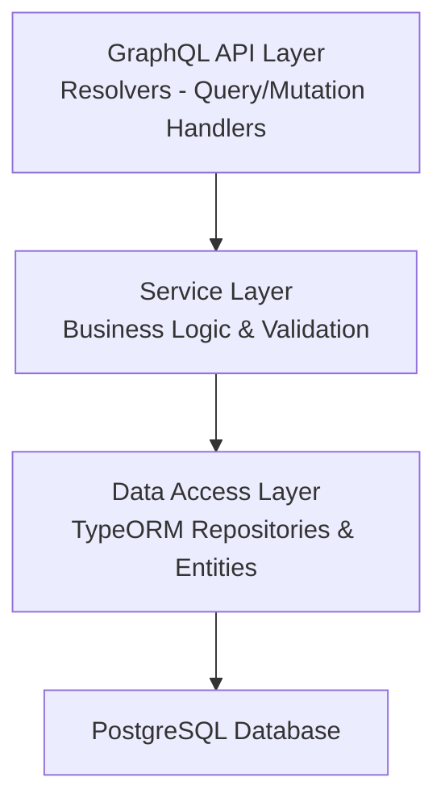
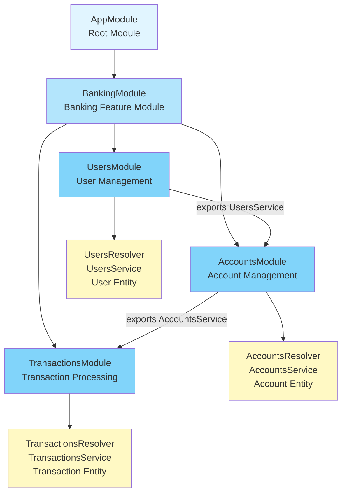

# Banking GraphQL API

A comprehensive banking application built with NestJS and GraphQL, demonstrating modern backend architecture patterns, GraphQL API design, and database transaction management. This project serves as an educational example of building a production-ready GraphQL API with proper separation of concerns, type safety, and data integrity.

## Table of Contents

- [Overview](#overview)
- [Architecture](#architecture)
- [Technology Stack](#technology-stack)
- [Why This Architecture?](#why-this-architecture)
- [Project Structure](#project-structure)
- [How It Works](#how-it-works)
- [Getting Started](#getting-started)
- [API Documentation](#api-documentation)
- [Database Schema](#database-schema)
- [Key Features](#key-features)

## Overview

This banking application provides a GraphQL API for managing users, bank accounts, and financial transactions. It implements core banking operations including:

- User management (create and query users)
- Account management (open accounts with different types and currencies)
- Transaction processing (deposits and transfers with balance validation)
- Transaction history (query transactions by account)

The application demonstrates best practices in:
- GraphQL schema design and resolver patterns
- Database transactions for data consistency
- TypeORM entity relationships
- Input validation and error handling
- Modular architecture with NestJS

## Architecture

### High-Level Architecture

The application follows a layered architecture pattern:



### Module Organization

The application is organized into feature modules following NestJS best practices:

- **BankingModule**: Main feature module that aggregates all banking-related functionality
  - **UsersModule**: User management (CRUD operations)
  - **AccountsModule**: Account management (opening accounts, querying accounts)
  - **TransactionsModule**: Transaction processing (deposits, transfers, history)



Each module follows the same structure:
- `*.resolver.ts`: GraphQL resolvers (entry points for queries/mutations)
- `*.service.ts`: Business logic and data operations
- `entities/`: TypeORM entity definitions (database models)
- `dto/`: Data Transfer Objects for input validation

## Technology Stack

### Core Framework
- **NestJS**: Progressive Node.js framework for building efficient and scalable server-side applications
  - Why NestJS: Provides dependency injection, modular architecture, and excellent TypeScript support out of the box

### GraphQL
- **@nestjs/graphql**: NestJS GraphQL integration
- **@nestjs/apollo**: Apollo Server integration for NestJS
- **graphql**: Core GraphQL library
  - Why GraphQL: Enables clients to request exactly the data they need, reducing over-fetching and under-fetching common in REST APIs

### Database
- **TypeORM**: Object-Relational Mapping library
- **PostgreSQL**: Relational database
  - Why TypeORM: Type-safe database operations, migrations support, and excellent NestJS integration
  - Why PostgreSQL: ACID compliance, robust transaction support, and strong data integrity features essential for banking applications

### Validation
- **class-validator**: Decorator-based validation
- **class-transformer**: Object transformation utilities
  - Why: Ensures data integrity at the API boundary before business logic execution

## Why This Architecture?

### 1. GraphQL Over REST

**Problem**: REST APIs often lead to over-fetching (getting more data than needed) or under-fetching (requiring multiple requests).

**Solution**: GraphQL allows clients to specify exactly what data they need in a single request.

**Example**:
```graphql
# Client requests only needed fields
query {
  user(id: "123") {
    email
    fullName
  }
}
```

### 2. Modular Architecture

**Problem**: Monolithic codebases become difficult to maintain and scale.

**Solution**: Feature-based modules with clear boundaries and responsibilities.

**Benefits**:
- Each module is self-contained and testable
- Easy to add new features without affecting existing code
- Clear separation between GraphQL layer, business logic, and data access

### 3. Service Layer Pattern

**Problem**: Business logic mixed with API handlers makes code hard to test and reuse.

**Solution**: Resolvers delegate to services that contain all business logic.

**Benefits**:
- Business logic can be tested independently
- Services can be reused by different resolvers or other parts of the application
- Clear separation of concerns

### 4. Database Transactions

**Problem**: Financial operations must be atomic - if any step fails, all changes must be rolled back.

**Solution**: Use database transactions for operations that modify multiple records.

**Example**: When transferring funds:
1. Debit from source account
2. Credit to destination account
3. Create transaction record

If any step fails, the entire operation is rolled back, ensuring data consistency.

### 5. Type Safety

**Problem**: Runtime errors from type mismatches are hard to catch and debug.

**Solution**: TypeScript throughout the stack, from GraphQL types to database entities.

**Benefits**:
- Compile-time error detection
- Better IDE support and autocomplete
- Self-documenting code

## Project Structure

```
src/
├── main.ts                 # Application entry point
├── app.module.ts          # Root module (configures GraphQL, TypeORM, etc.)
├── schema.graphql         # Auto-generated GraphQL schema
│
└── banking/               # Banking feature module
    ├── banking.module.ts  # Aggregates all banking sub-modules
    │
    ├── users/            # User management module
    │   ├── users.resolver.ts
    │   ├── users.service.ts
    │   ├── entities/
    │   │   └── user.entity.ts
    │   └── dto/
    │       └── create-user.dto.ts
    │
    ├── accounts/          # Account management module
    │   ├── accounts.resolver.ts
    │   ├── accounts.service.ts
    │   ├── entities/
    │   │   └── account.entity.ts
    │   └── dto/
    │       └── create-account.dto.ts
    │
    ├── transactions/      # Transaction processing module
    │   ├── transactions.resolver.ts
    │   ├── transactions.service.ts
    │   ├── entities/
    │   │   └── transaction.entity.ts
    │   └── dto/
    │       ├── deposit-funds.input.ts
    │       └── transfer-funds.input.ts
    │
    └── models/            # Shared GraphQL types and enums
        ├── banking-graphql-types.ts
        └── banking.enums.ts

docs/
├── queries.graphql        # Example queries
├── mutations.graphql      # Example mutations
└── README.md             # Documentation for examples
```

## How It Works

### Step 1: Request Flow

When a GraphQL query or mutation is received:

1. **GraphQL Layer**: The request is parsed and validated against the schema
2. **Resolver**: The appropriate resolver method is called
3. **Service**: The resolver delegates to a service method containing business logic
4. **Repository**: The service uses TypeORM repositories to interact with the database
5. **Response**: Data flows back through the layers, transformed to match the GraphQL schema

### Step 2: User Creation Example

```graphql
mutation {
  createUser(input: {
    email: "user@example.com"
    fullName: "John Doe"
  }) {
    id
    email
  }
}
```

**Flow**:
1. `UsersResolver.createUser()` receives the input
2. `UsersService.create()` validates and creates the user entity
3. TypeORM saves the user to the database
4. The created user is returned and formatted according to the GraphQL query

### Step 3: Account Opening Example

```graphql
mutation {
  openAccount(input: {
    userId: "user-id"
    type: CHECKING
    currency: USD
    alias: "My Checking Account"
  }) {
    id
    accountNumber
    balance
  }
}
```

**Flow**:
1. `AccountResolver.openAccount()` receives the input
2. `AccountsService.openAccount()`:
   - Validates the user exists
   - Generates a unique account number
   - Creates the account with initial balance of 0
   - Saves to database
3. Returns the created account

### Step 4: Transaction Processing Example

#### Deposit

```graphql
mutation {
  deposit(input: {
    toAccountId: "account-id"
    amount: 1000.00
    description: "Initial deposit"
  }) {
    id
    status
    toAccount {
      balance
    }
  }
}
```

**Flow**:
1. `TransactionsResolver.deposit()` receives the input
2. `TransactionsService.deposit()` executes within a database transaction:
   - Finds the account
   - Updates the account balance (atomic operation)
   - Creates a transaction record
   - If any step fails, the entire operation is rolled back
3. Returns the transaction with updated account balance

#### Transfer

```graphql
mutation {
  transferFunds(input: {
    fromAccountId: "account-1"
    toAccountId: "account-2"
    amount: 500.00
    description: "Payment"
  }) {
    id
    status
    fromAccount { balance }
    toAccount { balance }
  }
}
```

**Flow**:
1. `TransactionsResolver.transferFunds()` receives the input
2. `TransactionsService.transferFunds()` executes within a database transaction:
   - Validates both accounts exist
   - Validates currency match
   - Validates sufficient funds
   - Debits from source account
   - Credits to destination account
   - Creates transaction record
   - All operations are atomic (all succeed or all fail)
3. Returns the transaction with updated balances

### Step 5: Querying Data

```graphql
query {
  transactionsByAccount(accountId: "account-id") {
    id
    amount
    type
    status
    createdAt
  }
}
```

**Flow**:
1. `TransactionsResolver.transactionsByAccount()` receives the account ID
2. `TransactionsService.listByAccount()` queries the database:
   - Finds all transactions where the account is either sender or receiver
   - Includes related account data
   - Orders by creation date (newest first)
3. Returns the list of transactions

## Getting Started

### Prerequisites

- Node.js (v22.21.1 or higher)
- Yarn package manager
- Docker and Docker Compose (for PostgreSQL)

### Installation

1. **Clone the repository**
   ```bash
   git clone <repository-url>
   cd nest-graphql-bank
   ```

2. **Install dependencies**
   ```bash
   yarn install
   ```

3. **Set up environment variables**
   
   A `.env.template` file is provided as a reference. Create a `.env` file in the root directory with simulated data:
   ```env
   POSTGRES_HOST=localhost
   POSTGRES_PORT=5432
   POSTGRES_USER=bank_user
   POSTGRES_PASSWORD=bank_password
   POSTGRES_DB=bank_db
   PORT=3000
   ```
   
   You can copy the template file and modify the values as needed:
   ```bash
   cp .env.template .env
   ```

4. **Start PostgreSQL database**
   ```bash
   docker compose up -d
   ```

5. **Start the application**
   ```bash
   yarn start:dev
   ```

   The application will be available at `http://localhost:3000`
   GraphQL Playground will be available at `http://localhost:3000/graphql`

### Development Commands

```bash
# Start in development mode (with hot reload)
yarn start:dev

# Build for production
yarn build

# Start in production mode
yarn start:prod

# Run linter
yarn lint

# Run tests
yarn test

# Run e2e tests
yarn test:e2e
```

## API Documentation

### GraphQL Endpoint

The GraphQL API is available at:
```
http://localhost:3000/graphql
```

### Interactive Documentation

Apollo Studio Sandbox is available at the same endpoint, providing:
- Interactive query editor
- Schema explorer
- Query history
- Variable editor

### Example Queries and Mutations

Complete examples are available in the `docs/` directory:

- **[Queries Examples](./docs/queries.graphql)** - All available GraphQL queries
- **[Mutations Examples](./docs/mutations.graphql)** - All available GraphQL mutations

These files contain ready-to-use examples that you can copy and paste into your GraphQL client.

### Quick Start Example

1. **Create a user:**
   ```graphql
   mutation {
     createUser(input: {
       email: "john.doe@example.com"
       fullName: "John Doe"
     }) {
       id
       email
       fullName
     }
   }
   ```

2. **Open an account:**
   ```graphql
   mutation {
     openAccount(input: {
       userId: "<user-id-from-step-1>"
       type: CHECKING
       currency: USD
       alias: "My Checking Account"
     }) {
       id
       accountNumber
       balance
     }
   }
   ```

3. **Deposit funds:**
   ```graphql
   mutation {
     deposit(input: {
       toAccountId: "<account-id-from-step-2>"
       amount: 1000.00
       description: "Initial deposit"
     }) {
       id
       status
       toAccount {
         balance
       }
     }
   }
   ```

## Database Schema

### Entity Relationships

```
User (1) ────< (Many) Account
Account (1) ────< (Many) Transaction (as fromAccount)
Account (1) ────< (Many) Transaction (as toAccount)
```

### Tables

#### users
- `id` (UUID, Primary Key)
- `fullname` (String)
- `email` (String, Unique)
- `created_at` (Timestamp)
- `updated_at` (Timestamp)

#### accounts
- `id` (UUID, Primary Key)
- `account_number` (String, Unique)
- `alias` (String, Nullable)
- `type` (Enum: CHECKING, SAVINGS)
- `currency` (Enum: USD, PEN)
- `balance` (Decimal 18,2)
- `user_id` (UUID, Foreign Key → users.id)
- `created_at` (Timestamp)
- `updated_at` (Timestamp)

#### transactions
- `id` (UUID, Primary Key)
- `from_account` (UUID, Foreign Key → accounts.id, Nullable)
- `to_account` (UUID, Foreign Key → accounts.id)
- `type` (Enum: DEPOSIT, TRANSFER, WITHDRAWAL)
- `status` (Enum: PENDING, COMPLETED, FAILED)
- `amount` (Decimal 18,2)
- `currency` (Enum: USD, PEN)
- `description` (String, Nullable)
- `created_at` (Timestamp)

### Design Decisions

1. **Decimal for Money**: Using `decimal` type instead of `float` to avoid floating-point precision errors in financial calculations.

2. **UUID Primary Keys**: Using UUIDs instead of auto-incrementing integers for better security and distributed system compatibility.

3. **Nullable fromAccount**: Deposits don't have a source account, so `fromAccount` is nullable. Transfers require both accounts.

4. **Transaction Status**: Allows for future implementation of pending transactions, retry logic, and transaction history auditing.

## Key Features

### 1. Type Safety
- Full TypeScript coverage from GraphQL schema to database entities
- Compile-time type checking prevents common runtime errors

### 2. Input Validation
- All inputs validated using `class-validator` decorators
- Validation errors returned in a structured format

### 3. Database Transactions
- Financial operations wrapped in database transactions
- Ensures atomicity: all operations succeed or all fail
- Prevents data inconsistencies

### 4. Error Handling
- Structured error responses
- Meaningful error messages
- Proper HTTP status codes

### 5. Schema-First Approach
- GraphQL schema auto-generated from TypeScript decorators
- Schema file serves as documentation
- Type safety between schema and resolvers

### 6. Modular Design
- Feature-based module organization
- Easy to extend with new features
- Clear separation of concerns

## Testing the API

### Using Apollo Studio Sandbox

1. Start the application: `yarn start:dev`
2. Navigate to `http://localhost:3000/graphql`
3. Use the interactive editor to write and execute queries

### Using cURL

```bash
curl -X POST http://localhost:3000/graphql \
  -H "Content-Type: application/json" \
  -d '{"query":"{ users { id email fullName } }"}'
```

### Using Postman or Insomnia

- **URL**: `http://localhost:3000/graphql`
- **Method**: POST
- **Content-Type**: `application/json`
- **Body**: JSON with `query` and optional `variables` fields

## License

This project is licensed under the MIT License.

## Author

**Luis Guisado**

- Blog: [https://blog.luisguisado.cloud](https://blog.luisguisado.cloud)
